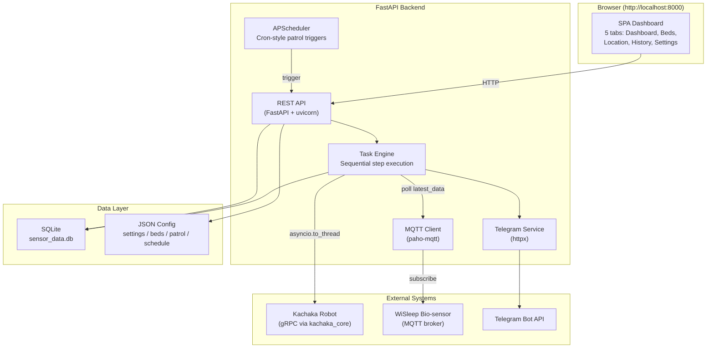
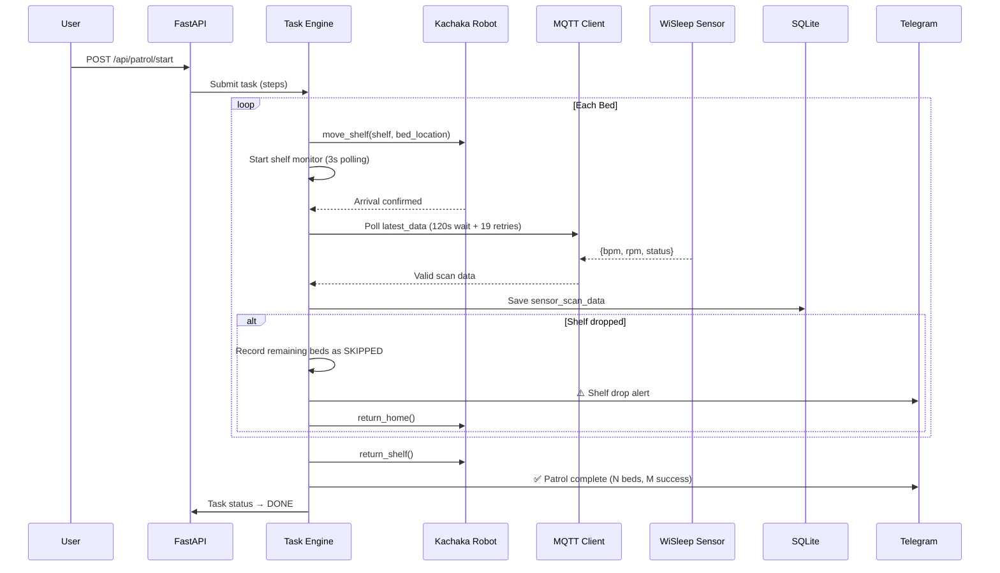
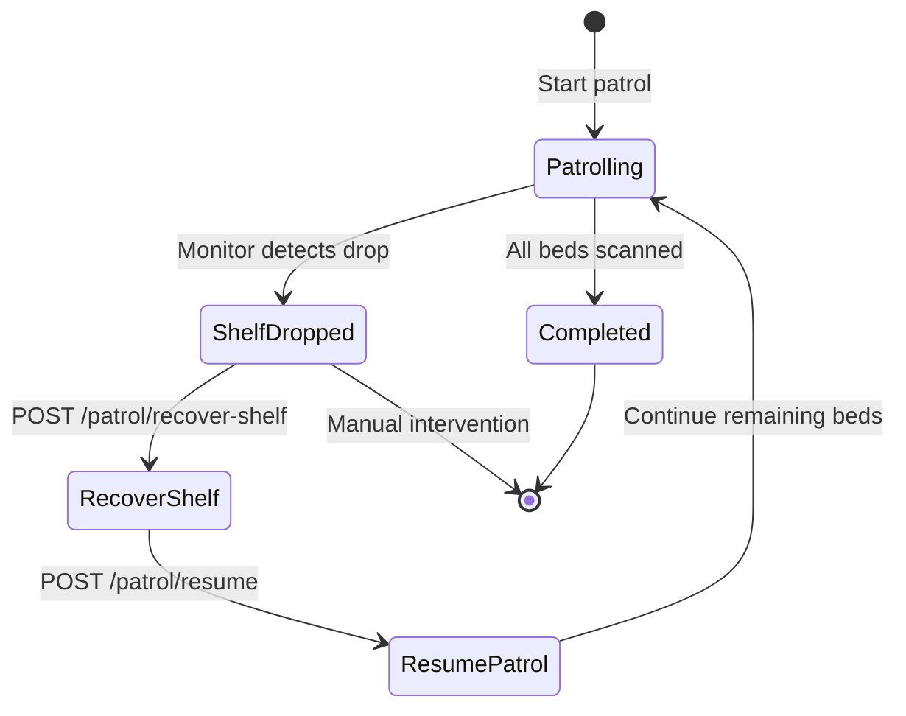

# Bio Patrol

Kachaka 機器人自動巡房系統 — 搭載生理感測器，自動巡視病房床位，透過 MQTT 收集心率/呼吸數據，異常時即時 Telegram 通報。

Autonomous hospital ward patrol system for **Kachaka Robot** with bio-sensor integration. Automatically visits hospital beds, collects vital signs (heart rate, respiration rate) via MQTT, and sends real-time Telegram alerts on abnormalities.


## Tech Stack

| Layer | Technology |
|-------|-----------|
| Backend | FastAPI, Python 3.12, uvicorn |
| Robot API | gRPC / protobuf via [`kachaka-sdk-toolkit`](https://github.com/sigmarobotics/kachaka-sdk-toolkit) (`kachaka_core`) |
| Bio-sensor | MQTT (paho-mqtt 2.x), WiSleep device |
| Scheduling | APScheduler (cron-style daily/weekday) |
| Database | SQLite |
| Frontend | Vanilla JS SPA, Canvas map rendering |
| Notifications | Telegram Bot API (httpx) |
| Deployment | Docker multi-arch (amd64 + arm64) |

## Architecture



## Patrol Flow



## Shelf Drop Detection & Recovery



## Quick Start

### Docker (recommended)

```bash
docker compose up
```

### Local Development

```bash
uv sync
PYTHONPATH=src/backend uv run uvicorn main:app --app-dir src/backend --reload
```

App runs at http://localhost:8000

## Frontend

5-tab SPA:

| Tab | Description |
|-----|-------------|
| **Dashboard** | Live map, bio-sensor data, schedule, patrol progress, quick actions |
| **Bed Selection** | Click-to-enable bed grid with auto-save, preset management |
| **Location Settings** | Room/bed layout, location ID mapping |
| **History** | Scan history, statistics, CSV export |
| **Settings** | Robot IP, MQTT, Telegram, scan timing, map management |

## Project Structure

```
bio-patrol/
├── src/
│   ├── backend/
│   │   ├── main.py                 # FastAPI app, lifespan, logging
│   │   ├── common_types.py         # Task, Step, Status enums
│   │   ├── dependencies.py         # DI: FleetAPI, MQTT singletons
│   │   ├── routers/
│   │   │   ├── tasks.py            # Task CRUD & queue
│   │   │   ├── kachaka.py          # Robot control endpoints
│   │   │   ├── settings.py         # Config, beds, patrol, schedule API
│   │   │   └── bio_sensor.py       # Sensor data & scan history
│   │   ├── services/
│   │   │   ├── fleet_api.py        # Async bridge to kachaka_core
│   │   │   ├── task_runtime.py     # Patrol execution engine
│   │   │   ├── scheduler.py        # APScheduler integration
│   │   │   ├── bio_sensor_mqtt.py  # MQTT client + SQLite
│   │   │   └── telegram_service.py # Telegram notifications
│   │   └── settings/
│   │       ├── config.py           # Config file paths & loading
│   │       └── defaults.py         # Default values
│   └── frontend/
│       ├── index.html              # SPA shell
│       ├── css/style.css
│       └── js/
│           ├── script.js           # Main UI + Canvas map
│           └── dataService.js      # API client
├── data/                           # Runtime data (Docker volume)
│   ├── config/                     # JSON configs
│   ├── maps/                       # Robot map PNGs
│   └── sensor_data.db              # SQLite
├── deploy/                         # Production Docker Compose
├── docs/                           # Documentation
├── Dockerfile                      # Multi-stage, ARM64-ready
├── docker-compose.yml              # Dev: app + Mosquitto
└── pyproject.toml
```

## Configuration

Runtime configs stored in `data/config/`, merged with defaults on load:

| File | Purpose |
|------|---------|
| `settings.json` | Robot IP, MQTT broker, Telegram, scan parameters |
| `beds.json` | Room/bed layout definitions |
| `patrol.json` | Patrol route (bed order, enabled state) |
| `schedule.json` | Scheduled patrol times (daily/weekday) |

## API Endpoints

### Patrol & Tasks

| Method | Endpoint | Description |
|--------|----------|-------------|
| `POST` | `/api/patrol/start` | Start patrol (mode: patrol/demo) |
| `POST` | `/api/patrol/resume` | Resume after shelf drop |
| `POST` | `/api/patrol/recover-shelf` | Reset shelf pose |
| `GET` | `/api/tasks` | List tasks |
| `GET` | `/api/tasks/{id}` | Task details |
| `POST` | `/api/tasks/{id}/cancel` | Cancel running task |

### Bio-sensor

| Method | Endpoint | Description |
|--------|----------|-------------|
| `GET` | `/api/bio-sensor/latest` | Latest MQTT reading |
| `GET` | `/api/bio-sensor/scan-history` | Historical scans |

### Robot Control

| Method | Endpoint | Description |
|--------|----------|-------------|
| `GET` | `/kachaka/robots` | Registered robots |
| `GET` | `/kachaka/{id}/battery` | Battery status |
| `GET` | `/kachaka/{id}/pose` | Robot position |
| `POST` | `/kachaka/{id}/command/move_shelf` | Move shelf |
| `POST` | `/kachaka/{id}/command/return_shelf` | Return shelf |
| `POST` | `/kachaka/{id}/command/return_home` | Return to charger |

### Settings

| Method | Endpoint | Description |
|--------|----------|-------------|
| `GET/POST` | `/api/settings` | Runtime settings |
| `GET/POST` | `/api/beds` | Bed layout |
| `GET/POST` | `/api/patrol` | Patrol route |
| `GET/POST` | `/api/schedule` | Patrol schedule |

## Deployment

CI/CD via GitHub Actions builds multi-arch Docker images:

- Platforms: `linux/amd64`, `linux/arm64`
- Registry: `ghcr.io/sigmarobotics/bio-patrol`

```bash
# Production
cd deploy && docker compose -f docker-compose.prod.yml up -d
```

## Documentation

| Document | Description |
|----------|-------------|
| [Architecture](docs/architecture.md) | System design, data flow, error handling |
| [架構文件](docs/zh/architecture.md) | 系統架構（中文） |
| [Bio Sensor](docs/BIO_SENSOR.md) | MQTT sensor integration |
| [gRPC Error Handling](docs/GRPC_ERROR_FIX_SUMMARY.md) | Retry logic & shelf drop detection |

## License

Apache License 2.0 — see [LICENSE](LICENSE).

Copyright 2026 Sigma Robotics
