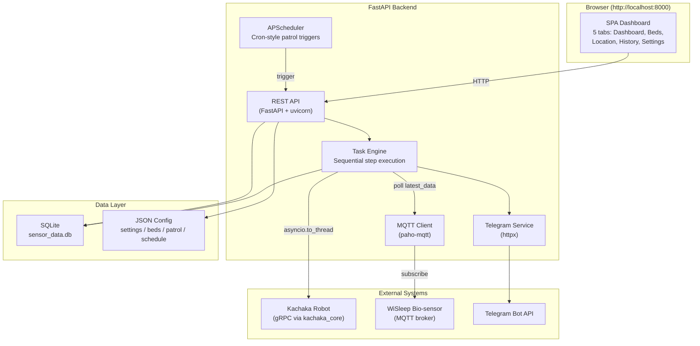
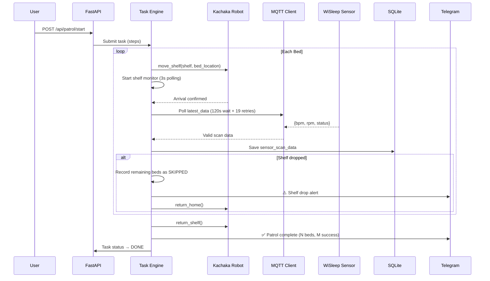
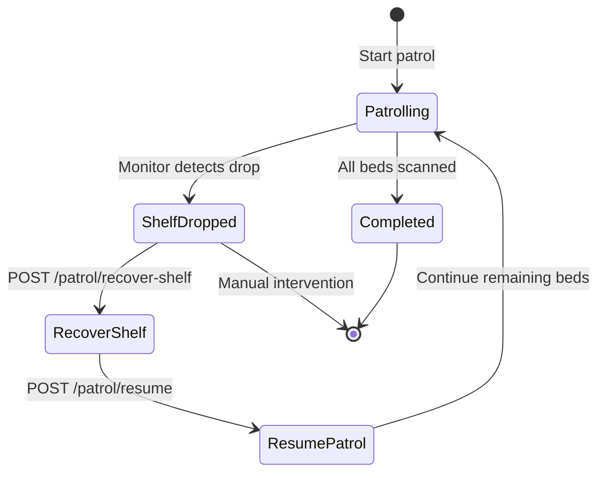
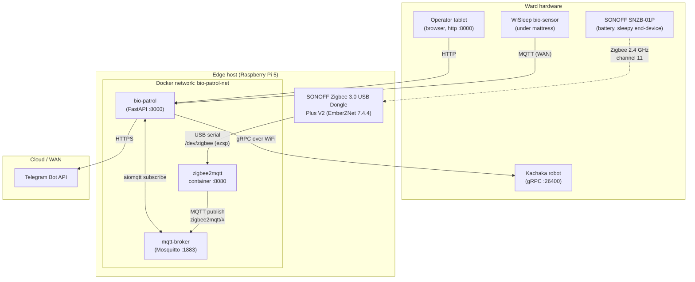

# Bio Patrol

Kachaka 機器人自動巡房系統 — 搭載生理感測器，自動巡視病房床位，透過 MQTT 收集心率/呼吸數據，異常時即時 Telegram 通報。

Autonomous hospital ward patrol system for **Kachaka Robot** with bio-sensor integration. Automatically visits hospital beds, collects vital signs (heart rate, respiration rate) via MQTT, and sends real-time Telegram alerts on abnormalities.


## Tech Stack

| Layer | Technology |
|-------|-----------|
| Backend | FastAPI, Python 3.12, uvicorn |
| Robot API | gRPC / protobuf via [`kachaka-sdk-toolkit`](https://github.com/sigmarobotics/kachaka-sdk-toolkit) (`kachaka_core`) |
| Bio-sensor | MQTT (paho-mqtt 2.x), WiSleep device |
| Zigbee buttons | zigbee2mqtt + aiomqtt, SONOFF SNZB-01P |
| Scheduling | APScheduler (cron-style daily/weekday) |
| Database | SQLite |
| Frontend | Vanilla JS SPA, Canvas map rendering |
| Notifications | Telegram Bot API (httpx) |
| Deployment | Docker multi-arch (amd64 + arm64) |

## Architecture


```mermaid
graph TB
    subgraph Browser["Browser (http://localhost:8000)"]
        UI["SPA Dashboard<br/>5 tabs: Dashboard, Beds,<br/>Location, History, Settings"]
    end

    subgraph Backend["FastAPI Backend"]
        API["REST API<br/>(FastAPI + uvicorn)"]
        TaskEngine["Task Engine<br/>Sequential step execution"]
        Scheduler["APScheduler<br/>Cron-style patrol triggers"]
        MQTT["MQTT Client<br/>(paho-mqtt)"]
        Telegram["Telegram Service<br/>(httpx)"]
    end

    subgraph Data["Data Layer"]
        SQLite["SQLite<br/>sensor_data.db"]
        Config["JSON Config<br/>settings / beds / patrol / schedule"]
    end

    subgraph External["External Systems"]
        Robot["Kachaka Robot<br/>(gRPC via kachaka_core)"]
        Sensor["WiSleep Bio-sensor<br/>(MQTT broker)"]
        TG["Telegram Bot API"]
    end

    UI -->|"HTTP"| API
    API --> TaskEngine
    Scheduler -->|"trigger"| API
    TaskEngine -->|"asyncio.to_thread"| Robot
    MQTT -->|"subscribe"| Sensor
    TaskEngine -->|"poll latest_data"| MQTT
    TaskEngine --> SQLite
    TaskEngine --> Telegram --> TG
    API --> Config
    API --> SQLite
```

## Patrol Flow


```mermaid
sequenceDiagram
    participant User
    participant API as FastAPI
    participant Engine as Task Engine
    participant Robot as Kachaka Robot
    participant MQTT as MQTT Client
    participant Sensor as WiSleep Sensor
    participant DB as SQLite
    participant TG as Telegram

    User->>API: POST /api/patrol/start
    API->>Engine: Submit task (steps)

    loop Each Bed
        Engine->>Robot: move_shelf(shelf, bed_location)
        Engine->>Engine: Start shelf monitor (3s polling)
        Robot-->>Engine: Arrival confirmed
        Engine->>MQTT: Poll latest_data (120s wait + 19 retries)
        Sensor-->>MQTT: {bpm, rpm, status}
        MQTT-->>Engine: Valid scan data
        Engine->>DB: Save sensor_scan_data

        alt Shelf dropped
            Engine->>Engine: Record remaining beds as SKIPPED
            Engine->>TG: ⚠️ Shelf drop alert
            Engine->>Robot: return_home()
        end
    end

    Engine->>Robot: return_shelf()
    Engine->>TG: ✅ Patrol complete (N beds, M success)
    Engine->>API: Task status → DONE
```

## Shelf Drop Detection & Recovery


```mermaid
stateDiagram-v2
    [*] --> Patrolling: Start patrol
    Patrolling --> ShelfDropped: Monitor detects drop
    Patrolling --> Completed: All beds scanned
    ShelfDropped --> RecoverShelf: POST /patrol/recover-shelf
    RecoverShelf --> ResumePatrol: POST /patrol/resume
    ResumePatrol --> Patrolling: Continue remaining beds
    Completed --> [*]
    ShelfDropped --> [*]: Manual intervention
```

## Hardware Topology

Bio Patrol is a multi-machine system. The bio-patrol container runs on an edge host (typically a Raspberry Pi 5) that is on the same WiFi as the Kachaka robot and the WiSleep bio-sensor. The same host also owns a Zigbee coordinator that talks to SNZB-01P buttons.


```mermaid
graph TB
    subgraph WardHW["Ward hardware"]
        Btn["SONOFF SNZB-01P<br/>(battery, sleepy end-device)"]
        WiSleep["WiSleep bio-sensor<br/>(under mattress)"]
        Kachaka["Kachaka robot<br/>(gRPC :26400)"]
        Tablet["Operator tablet<br/>(browser, http :8000)"]
    end

    subgraph EdgeHost["Edge host (Raspberry Pi 5)"]
        Dongle["SONOFF Zigbee 3.0 USB Dongle<br/>Plus V2 (EmberZNet 7.4.4)"]
        subgraph DockerNet["Docker network: bio-patrol-net"]
            Z2M["zigbee2mqtt<br/>container :8080"]
            Mosq["mqtt-broker<br/>(Mosquitto :1883)"]
            App["bio-patrol<br/>(FastAPI :8000)"]
        end
    end

    subgraph Cloud["Cloud / WAN"]
        TG["Telegram Bot API"]
    end

    Btn -.->|"Zigbee 2.4 GHz<br/>channel 11"| Dongle
    Dongle -->|"USB serial<br/>/dev/zigbee (ezsp)"| Z2M
    Z2M -->|"MQTT publish<br/>zigbee2mqtt/#"| Mosq
    App <-->|"aiomqtt subscribe"| Mosq
    WiSleep -->|"MQTT (WAN)"| App
    Tablet -->|"HTTP"| App
    App -->|"gRPC over WiFi"| Kachaka
    App -->|"HTTPS"| TG
```

Key points:

- The Zigbee coordinator (USB dongle) and the bio-patrol container live on the same physical host. The Zigbee path stays local — it does **not** depend on WiFi or the WAN.
- The bio-patrol container talks to **two** MQTT brokers: the local `mqtt-broker` (for Zigbee buttons via `zigbee2mqtt`) and the upstream WiSleep broker (for bio-sensor data). They are independent.
- The operator tablet is a plain browser — all UI is served by the bio-patrol container.

## Zigbee Button Hub

Nurses and visitors can trigger common bio-patrol actions from a physical button instead of opening the tablet UI. Up to six SONOFF SNZB-01P buttons can be paired, one per action:

| Action key | Triggered behaviour |
|------------|---------------------|
| `demo_run` | `POST /api/patrol/start {mode:"demo"}` |
| `shelf_resume` | `POST /api/patrol/resume-latest` (auto-finds the newest shelf-dropped task) |
| `patrol_start` | `POST /api/patrol/start {mode:"patrol"}` |
| `patrol_cancel` | Cancel the currently running task |
| `return_home` | `fleet.return_home("kachaka")` |
| `speak` | `fleet.speak("kachaka", "こんにちは、シグマです")` (test announcement) |

### Required hardware

| Component | Notes |
|-----------|-------|
| SONOFF Zigbee 3.0 USB Dongle Plus **V2** | Itead, EmberZNet 7.4.4 (EZSP v13) firmware. Use the `ezsp` adapter — see "Adapter: ezsp" below. |
| SONOFF SNZB-01P button(s) | Battery-powered, sleepy end-device. CR2477 battery. Up to 6 paired (one per action). |
| Edge host | Raspberry Pi 5 (or any Linux box with USB + Docker). |

### Pairing a button (operator workflow)

1. Open the bio-patrol UI → **Settings** tab → scroll to **Zigbee Buttons** panel.
2. Click **配對 (Pair)** on the action you want to bind.
3. **Long-press the SNZB-01P for ~5 seconds** until the LED blinks once, then release.
4. The row updates with the device's IEEE address, battery, and last-seen time.

Full operator manual including troubleshooting and recovery procedures is in [docs/buttons-manual.md](docs/buttons-manual.md).

### REST API (for automation / debugging)

| Method | Endpoint | Description |
|--------|----------|-------------|
| `GET` | `/api/button-bindings` | List all 6 actions + binding state + pairing status |
| `POST` | `/api/button-bindings/{action}/pair` | Arm pairing on an action (120 s window) |
| `POST` | `/api/button-bindings/{action}/pair/cancel` | Cancel an armed pairing |
| `DELETE` | `/api/button-bindings/{action}?forget_device=true` | Unpair (and optionally remove device from z2m) |
| `POST` | `/api/button-bindings/{action}/test` | Fire the action handler without a physical press |

## Quick Start

### Docker (recommended)

```bash
docker compose up
```

The `docker compose up` brings up three services: `app` (bio-patrol), `mqtt-broker` (Mosquitto, used by Zigbee), and `zigbee2mqtt` (Zigbee coordinator daemon). For the Zigbee dongle to be visible inside the `zigbee2mqtt` container, you need a stable device path on the host — see [docs/buttons-manual.md](docs/buttons-manual.md) for the udev rule.

If you do not have a Zigbee dongle attached, set `zigbee_enabled: false` in `data/config/settings.json` (the FastAPI lifespan will skip Zigbee initialisation cleanly) and remove or stop the `zigbee2mqtt` service.

### Local Development

```bash
uv sync
PYTHONPATH=src/backend uv run uvicorn main:app --app-dir src/backend --reload
```

App runs at http://localhost:8000

## Frontend

5-tab SPA:

| Tab | Description |
|-----|-------------|
| **Dashboard** | Live map, bio-sensor data, schedule, patrol progress, quick actions |
| **Bed Selection** | Click-to-enable bed grid with auto-save, preset management |
| **Location Settings** | Room/bed layout, location ID mapping |
| **History** | Scan history, statistics, CSV export |
| **Settings** | Robot IP, MQTT, Telegram, scan timing, map management |

## Project Structure

```
bio-patrol/
├── src/
│   ├── backend/
│   │   ├── main.py                 # FastAPI app, lifespan, logging
│   │   ├── common_types.py         # Task, Step, Status enums
│   │   ├── dependencies.py         # DI: FleetAPI, MQTT singletons
│   │   ├── routers/
│   │   │   ├── tasks.py            # Task CRUD & queue
│   │   │   ├── kachaka.py          # Robot control endpoints
│   │   │   ├── settings.py         # Config, beds, patrol, schedule API
│   │   │   ├── bio_sensor.py       # Sensor data & scan history
│   │   │   └── buttons.py          # Zigbee button bindings REST API
│   │   ├── services/
│   │   │   ├── fleet_api.py        # Async bridge to kachaka_core
│   │   │   ├── task_runtime.py     # Patrol execution engine
│   │   │   ├── scheduler.py        # APScheduler integration
│   │   │   ├── bio_sensor_mqtt.py  # MQTT client + SQLite
│   │   │   ├── telegram_service.py # Telegram notifications
│   │   │   ├── zigbee_mqtt.py      # aiomqtt client for zigbee2mqtt
│   │   │   ├── button_manager.py   # Pair/press dispatch
│   │   │   ├── action_registry.py  # 6 default button actions
│   │   │   └── button_db.py        # button_bindings SQLite table
│   │   └── settings/
│   │       ├── config.py           # Config file paths & loading
│   │       └── defaults.py         # Default values
│   └── frontend/
│       ├── index.html              # SPA shell
│       ├── css/style.css
│       └── js/
│           ├── script.js           # Main UI + Canvas map
│           ├── buttons.js          # Settings → Zigbee Buttons panel
│           └── dataService.js      # API client
├── zigbee2mqtt/
│   └── configuration.yaml          # z2m config (adapter: ezsp)
├── data/                           # Runtime data (Docker volume)
│   ├── config/                     # JSON configs
│   ├── maps/                       # Robot map PNGs
│   └── sensor_data.db              # SQLite (sensor scans + button bindings)
├── deploy/                         # Production Docker Compose
├── docs/                           # Documentation
├── Dockerfile                      # Multi-stage, ARM64-ready
├── docker-compose.yml              # Dev: app + Mosquitto + zigbee2mqtt
└── pyproject.toml
```

## Configuration

Runtime configs stored in `data/config/`, merged with defaults on load:

| File | Purpose |
|------|---------|
| `settings.json` | Robot IP, MQTT broker, Telegram, scan parameters |
| `beds.json` | Room/bed layout definitions |
| `patrol.json` | Patrol route (bed order, enabled state) |
| `schedule.json` | Scheduled patrol times (daily/weekday) |

## API Endpoints

### Patrol & Tasks

| Method | Endpoint | Description |
|--------|----------|-------------|
| `POST` | `/api/patrol/start` | Start patrol (mode: patrol/demo) |
| `POST` | `/api/patrol/resume` | Resume a specific shelf-dropped task |
| `POST` | `/api/patrol/resume-latest` | Resume the newest shelf-dropped task (used by `shelf_resume` button) |
| `POST` | `/api/patrol/recover-shelf` | Reset shelf pose |
| `GET` | `/api/tasks` | List tasks |
| `GET` | `/api/tasks/{id}` | Task details |
| `POST` | `/api/tasks/{id}/cancel` | Cancel running task |

### Bio-sensor

| Method | Endpoint | Description |
|--------|----------|-------------|
| `GET` | `/api/bio-sensor/latest` | Latest MQTT reading |
| `GET` | `/api/bio-sensor/scan-history` | Historical scans |

### Robot Control

| Method | Endpoint | Description |
|--------|----------|-------------|
| `GET` | `/kachaka/robots` | Registered robots |
| `GET` | `/kachaka/{id}/battery` | Battery status |
| `GET` | `/kachaka/{id}/pose` | Robot position |
| `POST` | `/kachaka/{id}/command/move_shelf` | Move shelf |
| `POST` | `/kachaka/{id}/command/return_shelf` | Return shelf |
| `POST` | `/kachaka/{id}/command/return_home` | Return to charger |

### Settings

| Method | Endpoint | Description |
|--------|----------|-------------|
| `GET/POST` | `/api/settings` | Runtime settings |
| `GET/POST` | `/api/beds` | Bed layout |
| `GET/POST` | `/api/patrol` | Patrol route |
| `GET/POST` | `/api/schedule` | Patrol schedule |

## Deployment

CI/CD via GitHub Actions builds multi-arch Docker images:

- Platforms: `linux/amd64`, `linux/arm64`
- Registry: `ghcr.io/sigmarobotics/bio-patrol`

```bash
# Production
cd deploy && docker compose -f docker-compose.prod.yml up -d
```

## Documentation

| Document | Description |
|----------|-------------|
| [Architecture](docs/architecture.md) | System design, data flow, error handling |
| [架構文件](docs/zh/architecture.md) | 系統架構（中文） |
| [Bio Sensor](docs/BIO_SENSOR.md) | MQTT sensor integration |
| [gRPC Error Handling](docs/GRPC_ERROR_FIX_SUMMARY.md) | Retry logic & shelf drop detection |
| [Zigbee Button Hub — Operator Manual](docs/buttons-manual.md) | 配對 / 故障排除 / udev 設定 |

## License

Apache License 2.0 — see [LICENSE](LICENSE).

Copyright 2026 Sigma Robotics
