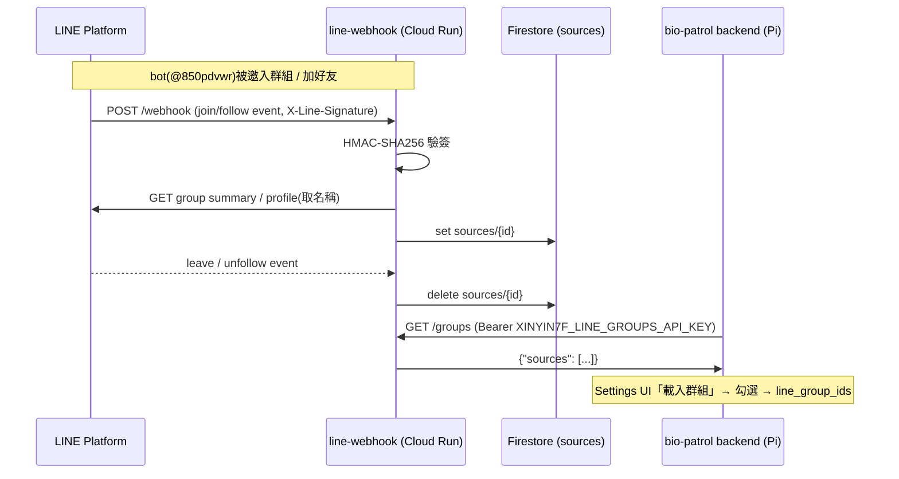

# line-webhook — LINE 群組捕捉服務

bio-patrol LINE 通報（IT-12）的配套雲端服務,跑在 **GCP 專案 `xinyin7f`** 的
Cloud Run(asia-east1)。LINE Platform 的 webhook 需要公網 HTTPS endpoint,
院內 Pi 上的 bio-patrol 無法直接接收,因此由這個小服務代收。

## 運作方式



推播本身不經過此服務——bio-patrol 後端拿著 channel access token 直接打
LINE push API;此服務只負責「知道有哪些群組可以推」。

## Endpoints

| Method | Path | 說明 |
|---|---|---|
| POST | `/webhook` | LINE platform events。驗 `X-Line-Signature`,記錄/移除 push targets |
| GET | `/groups` | 回傳已捕捉的 sources。需 `Authorization: Bearer <GROUPS_API_KEY>` |

（注意:`/healthz` 路徑會被 Google 前端攔截回 404,不要用它做 liveness。）

## 環境變數

名稱與工作機 token registry(`~/.config/sigma/dev.env`)一致,本地執行會
自動拿到正確的 channel 憑證:

| 變數 | 說明 |
|---|---|
| `XINYIN7F_LINE_CHANNEL_SECRET` | 驗 webhook 簽章(Sigma-Vital @850pdvwr channel 2010622635) |
| `XINYIN7F_LINE_CHANNEL_ACCESS_TOKEN` | 抓 group summary / user profile 名稱 |
| `XINYIN7F_LINE_GROUPS_API_KEY` | `GET /groups` 的 bearer key(bio-patrol settings `line_webhook_api_key` 填同一值) |

## 部署

```bash
source ~/.config/sigma/dev.env
gcloud run deploy line-webhook \
  --source deploy/line-webhook \
  --project=xinyin7f --region=asia-east1 --allow-unauthenticated --quiet \
  --set-env-vars "^@^XINYIN7F_LINE_CHANNEL_SECRET=${XINYIN7F_LINE_CHANNEL_SECRET}@XINYIN7F_LINE_CHANNEL_ACCESS_TOKEN=${XINYIN7F_LINE_CHANNEL_ACCESS_TOKEN}@XINYIN7F_LINE_GROUPS_API_KEY=${XINYIN7F_LINE_GROUPS_API_KEY}"
```

前置(一次性,已完成):`gcloud services enable run.googleapis.com
cloudbuild.googleapis.com artifactregistry.googleapis.com
firestore.googleapis.com`、`gcloud firestore databases create
--location=asia-east1`。

部署後把 webhook URL 註冊到 LINE(或在 LINE Developers Console 設定):

```bash
curl -X PUT https://api.line.me/v2/bot/channel/webhook/endpoint \
  -H "Authorization: Bearer $XINYIN7F_LINE_CHANNEL_ACCESS_TOKEN" \
  -H "Content-Type: application/json" \
  -d '{"endpoint":"https://<run-url>/webhook"}'
```

並確認 Console 的「Use webhook」為開啟(`GET
/v2/bot/channel/webhook/endpoint` 應回 `active: true`)。

## bio-patrol 端設定

Settings → 通報設定 → LINE:`Webhook 服務 URL` 填 Cloud Run URL、
`Webhook API Key` 填 `XINYIN7F_LINE_GROUPS_API_KEY`,Save 後按「載入群組」。
