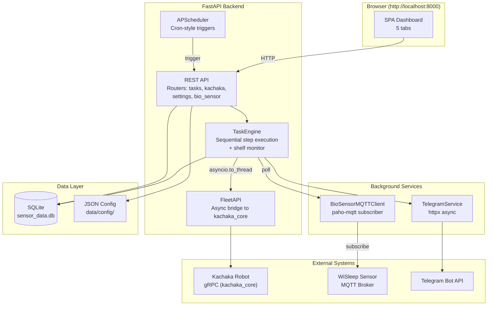
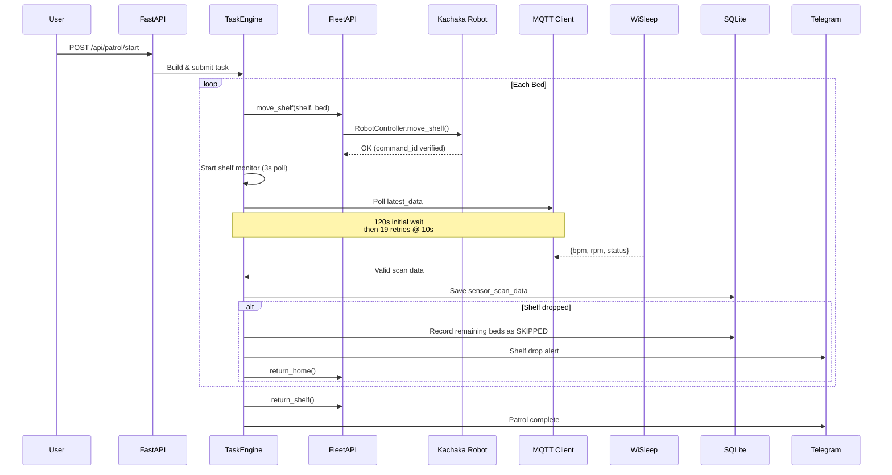
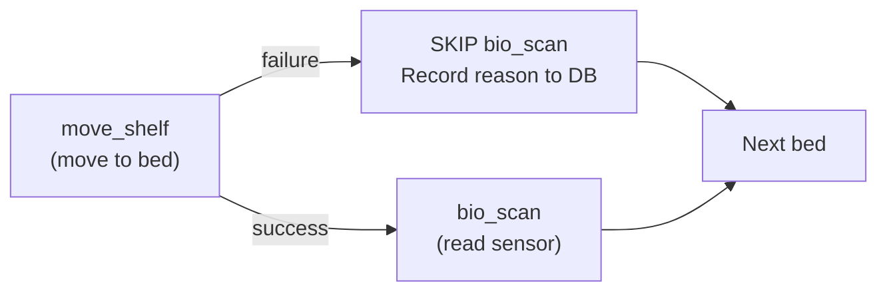
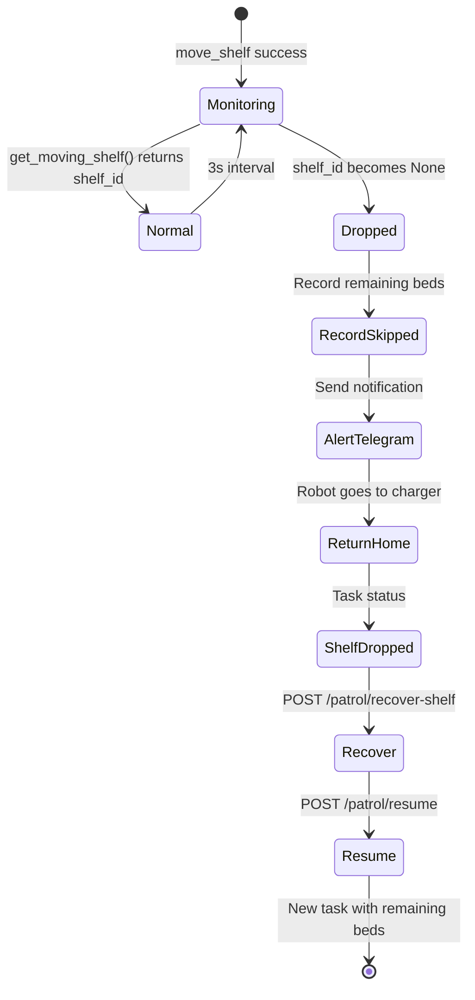
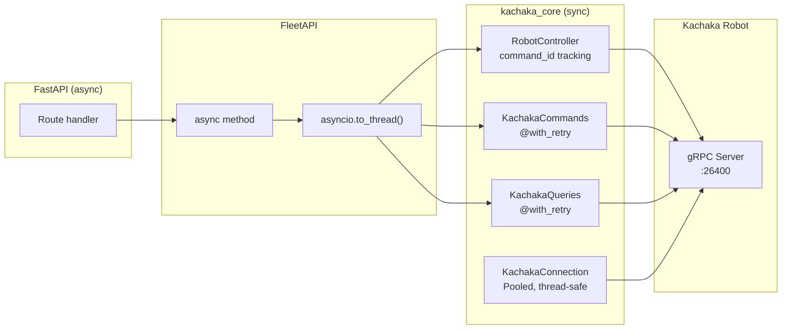
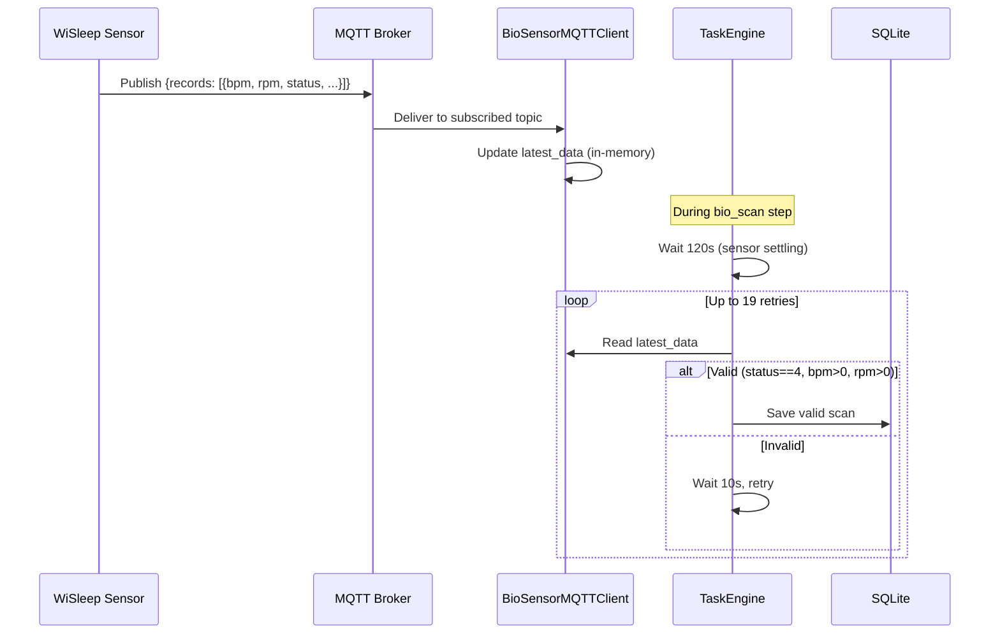
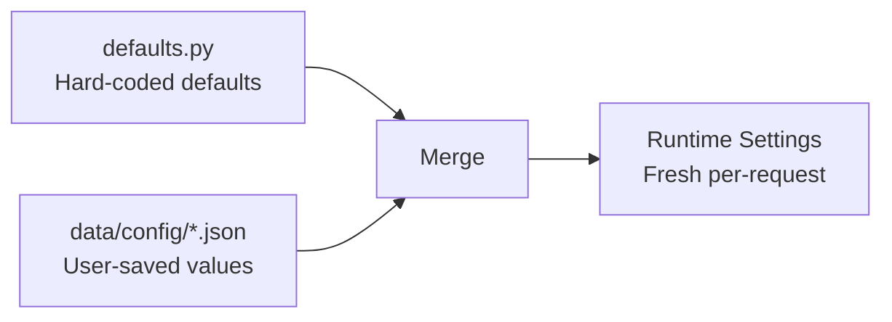

# Bio Patrol — Architecture

## Overview

Bio Patrol is an autonomous hospital ward patrol system built on the **Kachaka mobile robot** platform. The robot carries a sensor-equipped shelf to each bed, collects physiological data (heart rate, respiration rate) from **WiSleep bio-sensors** via MQTT, stores readings in SQLite, and sends Telegram alerts when abnormalities are detected.

The system uses **FastAPI** with an async task execution engine. Robot control flows through [`kachaka-sdk-toolkit`](https://github.com/sigmarobotics/kachaka-sdk-toolkit) (`kachaka_core`) with connection pooling, `@with_retry` decorators, and `RobotController` for command-ID verified execution.

## System Architecture

## Patrol Execution Flow

## Task Engine

The `TaskEngine` is the core execution component. It processes tasks as ordered sequences of steps with conditional skip logic.

### Step Types

| Step | Action | Description |
|------|--------|-------------|
| `move_shelf` | Move shelf to bed location | Starts shelf monitor on success |
| `bio_scan` | Read sensor data via MQTT | 120s wait + 19 retries @ 10s |
| `return_shelf` | Return shelf to home | Stops shelf monitor first |
| `wait` | Delay between steps | Configurable duration |
| `speak` | Robot speech | Announcement at bed |
| `return_home` | Return to charger | End of patrol |

### Conditional Skip Logic

If `move_shelf` fails, linked `bio_scan` steps are skipped (recorded in DB with reason). The patrol continues to the next bed.

### Shelf Drop Detection

## Kachaka Integration (kachaka_core)

All robot operations flow through `kachaka_core` via the `FleetAPI` async bridge:

### Per-Robot Slot

Each registered robot gets a `_RobotSlot` containing:
- `KachakaConnection` — pooled gRPC connection
- `RobotController` — background state polling + command execution
- `KachakaCommands` — simple operations with retry
- `KachakaQueries` — status queries with retry

## MQTT Bio-Sensor Flow

### Sensor Data Schema

| Field | Type | Description |
|-------|------|-------------|
| `status` | int | 4 = valid measurement |
| `bpm` | float | Heart rate |
| `rpm` | float | Respiration rate |
| `sn` | str | Sensor serial number |
| `signal` | str | Signal quality (e.g., "64/100") |
| `quality` | str | Data quality (e.g., "99/100") |
| `ssid` | str | Bed identifier (e.g., "B03-1") |

## Database

SQLite file: `data/sensor_data.db`

### sensor_scan_data Table

| Column | Type | Description |
|--------|------|-------------|
| `id` | INTEGER PK | Auto-increment |
| `task_id` | TEXT | Links to task |
| `location_id` | TEXT | Robot target location |
| `bed_name` | TEXT | Bed identifier (e.g., 101-1) |
| `timestamp` | TEXT | ISO 8601 |
| `retry_count` | INTEGER | Retries before reading |
| `status` | INTEGER | Sensor status code |
| `bpm` | REAL | Heart rate (NULL if invalid) |
| `rpm` | REAL | Respiration rate (NULL if invalid) |
| `is_valid` | BOOLEAN | Valid reading flag |
| `data_json` | TEXT | Full MQTT record |
| `details` | TEXT | Human-readable notes |

## Configuration

Runtime configs stored as JSON in `data/config/`, merged with defaults on load:

### Config Files

| File | Purpose |
|------|---------|
| `settings.json` | Robot IP, MQTT, Telegram, scan timing |
| `beds.json` | Room/bed layout and location ID mapping |
| `patrol.json` | Patrol route (bed order, enabled state) |
| `schedule.json` | Scheduled times (daily/weekday) |

### Key Settings

| Setting | Default | Description |
|---------|---------|-------------|
| `robot_ip` | — | Kachaka robot IP:port |
| `mqtt_broker` | `mqtt-broker` | MQTT broker hostname |
| `mqtt_port` | 1883 | MQTT port |
| `bio_scan_initial_wait` | 120 | Initial wait (seconds) |
| `bio_scan_wait_time` | 10 | Retry interval (seconds) |
| `bio_scan_retry_count` | 19 | Max retries |
| `bio_scan_valid_status` | 4 | Required sensor status |
| `shelf_id` | — | Shelf to carry |
| `timezone` | `Asia/Taipei` | Display timezone |

## Frontend

Vanilla JavaScript SPA with Canvas-based map rendering:

| Tab | Features |
|-----|----------|
| Dashboard | Live map, bio-sensor data, schedule, progress bar, quick actions |
| Bed Selection | Click-to-enable grid, auto-save (500ms debounce), presets |
| Location Settings | Room/bed layout, location ID mapping |
| History | Scan history table, statistics cards, CSV export |
| Settings | Robot IP, MQTT, Telegram, scan timing, map management |

## Logging

Per-module rotating log files in `data/logs/`:

| File | Modules |
|------|---------|
| `app.log` | Main lifecycle, fleet, telegram, settings |
| `task.log` | Patrol execution, robot commands |
| `sensor.log` | MQTT sensor data |
| `scheduler.log` | APScheduler events |

## CI/CD

GitHub Actions builds multi-arch Docker images:

- Platforms: `linux/amd64`, `linux/arm64`
- Registry: `ghcr.io/sigmarobotics/bio-patrol`
- Triggers: push to `main`, version tags
