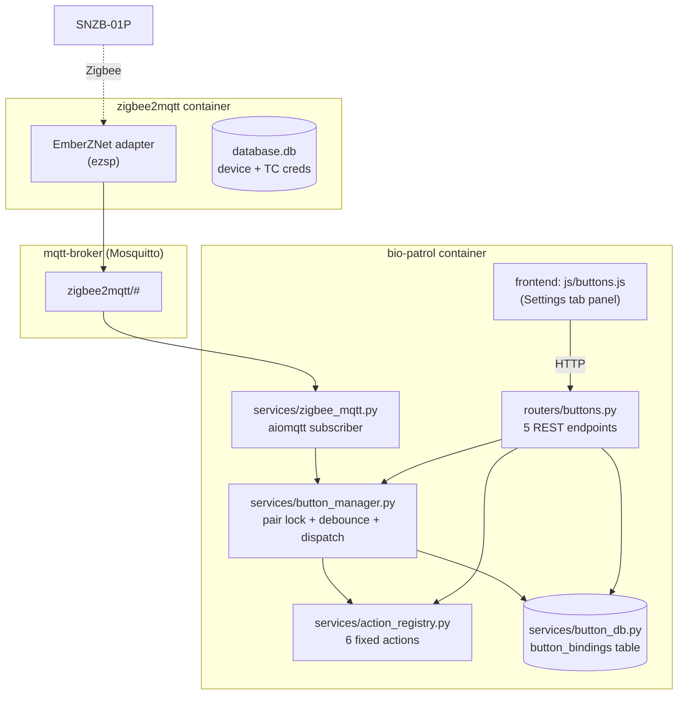

# IT-4 — Zigbee Button Hub: Design Notes

This document captures the architecture, hardware quirks, and decisions behind the IT-4 button hub. It is intentionally compact — the goal is for the next maintainer to skip the diagnosis journey we already paid for.

For operator-facing pairing, troubleshooting, and udev setup, see [buttons-manual.md](buttons-manual.md).

---

## 1. What IT-4 added

A physical button hub that lets nurses/visitors trigger common bio-patrol actions without opening the tablet UI. Six fixed actions are registered at startup; each action holds at most one paired SNZB-01P button.

| Action key | Triggered behaviour |
|------------|---------------------|
| `demo_run` | `POST /api/patrol/start {mode:"demo"}` |
| `shelf_resume` | `POST /api/patrol/resume-latest` |
| `patrol_start` | `POST /api/patrol/start {mode:"patrol"}` |
| `patrol_cancel` | Cancel the currently running task |
| `return_home` | `fleet.return_home("kachaka")` |
| `speak` | `fleet.speak("kachaka", "こんにちは、シグマです")` |

The action set is deliberately small and fixed (closed enum) — see "Why an action registry, not free-form binding" below.

## 2. Component layout



### File responsibilities

| File | Responsibility |
|------|---------------|
| `src/backend/services/zigbee_mqtt.py` | Long-running aiomqtt client. Subscribes `zigbee2mqtt/#`, parses bridge events + button_action messages, exposes `permit_join()` / `remove_device()`. Reconnects with exponential backoff. |
| `src/backend/services/button_manager.py` | Owns the pair lock and the IEEE → action dispatch. `_on_device_event` handles initial pair (via pair_target) **and** silent re-admit for already-bound IEEEs. `_on_button_action` debounces 0.3 s and fires the registered handler. |
| `src/backend/services/action_registry.py` | Registers the 6 default actions. Each handler is an async coroutine that calls into existing routers/services (intentionally — keeps button behaviour identical to UI behaviour). |
| `src/backend/services/button_db.py` | Single SQLite table `button_bindings` (one row per action_key, NULL ieee_addr means "unbound") in the existing `data/sensor_data.db`. Path-keyed sqlite connection cache so the 3 s UI poll does not spam `os.makedirs`. |
| `src/backend/routers/buttons.py` | 5 REST endpoints. Action-centric: `GET /api/button-bindings`, `POST /api/button-bindings/{action}/pair`, `.../pair/cancel`, `DELETE .../{action}`, `POST .../{action}/test`. |
| `src/frontend/js/buttons.js` | Settings-tab panel. Polls `/api/button-bindings` every 3 s, maintains a local pair countdown, renders one row per action. |
| `zigbee2mqtt/configuration.yaml` | z2m config — `adapter: ezsp`, points at `mqtt-broker:1883`, channel 11. |
| `docker-compose.yml` (and `deploy/docker-compose.prod.yml`) | Adds `zigbee2mqtt` service alongside the existing `mqtt-broker`. |

## 3. Decisions worth knowing

### 3.1 Why an action registry, not free-form binding

Buttons could have been bound to arbitrary URLs / shell commands. We deliberately did **not** do that:

- The action set is small and operator-driven — every action maps to a workflow already exposed in the UI.
- A closed registry means the button surface area is auditable: there is no "what does button X actually do" investigation later.
- Test-mode (`POST .../test`) reuses the exact same handler that physical presses use, so debugging is trivial.

If a new action is needed, add it to `DEFAULT_ACTIONS` in `action_registry.py` — that is the only place that needs to change. UI auto-renders a new row.

### 3.2 Why the `button_bindings` table holds one row per action_key (not per device)

| Schema | Trade-off |
|--------|-----------|
| **One row per action_key** (chosen) | UI is action-centric (which is what nurses think about). At most one button per action. Trivial to enumerate "which actions exist + which are paired". |
| One row per IEEE | Would let multiple buttons fire the same action — never asked for. Would also mean the UI needs to render an empty-state row per action separately, which is the same complexity in reverse. |

The unique partial index `idx_..._ieee ON button_bindings(ieee_addr) WHERE ieee_addr IS NOT NULL` enforces "one IEEE → at most one action" — re-pairing a button to a different action automatically clears the old binding.

### 3.3 Why bio-patrol talks to `mqtt-broker` and not directly to the dongle

Both `zigbee2mqtt` and bio-patrol are clients of the local Mosquitto broker. We do not put a Zigbee adapter inside the bio-patrol container. Reasons:

- `zigbee2mqtt` is the only project that knows how to drive the dongle correctly across firmware revisions; reinventing that inside bio-patrol is unjustifiable churn.
- The MQTT seam is also our test seam — `tests/unit/test_zigbee_mqtt_parser.py` exercises the parser without a dongle, and integration is just "is the broker reachable".
- The bio-sensor MQTT path (WiSleep) and the Zigbee MQTT path are independent — different brokers, different topic namespaces.

---

## 4. SNZB-01P firmware quirks (must understand)

### 4.1 The `Mgmt_Leave_req` "fake leave"

At the end of every press session, SNZB-01P sends a `Mgmt_Leave_req` to the coordinator. From the outside this looks like the device has left the network — z2m logs it that way and the device shows as "offline".

**It hasn't actually left.** The device is just entering deep sleep. z2m preserves the device record + TC link credentials in `database.db`. The next press triggers a TC-Rejoin and the message lands. This is by design and you should not try to "fix" it by closing permit_join more aggressively or by removing offline devices.

bio-patrol's `_on_device_event` handles this with a silent re-admit branch:

```python
existing = button_db.get_binding_by_ieee(ieee, self._db_path)
if existing and existing.get("action_key"):
    button_db.update_status(ieee, ...)
    logger.info("Bound device %s rejoined → %s", ieee, existing["action_key"])
    return
```

A re-admit that lands during pairing must **not** consume the pair_target — that is what this early-return guarantees.

### 4.2 The critical pairing bug we hit (and the fix)

Zigbee pairing is multi-stage: `device_joined` → `device_interview` → `interview_successful`. SNZB-01P **falls asleep mid-interview** because it is a sleepy end-device. If permit_join closes between the stages, the coordinator drops every subsequent step and the interview never completes.

Our first cut of `_on_device_event` closed permit_join immediately after binding the IEEE to the action_key. The symptom was: the UI showed "paired", but the button never actually fired any action. Looking at z2m logs: `device_joined` arrived, IEEE was written to `button_bindings`, but the interview was abandoned because permit_join was closed before z2m got `device_interview`.

**Fix**: do **not** close permit_join in `_on_device_event`. Let the original `arm_pair()` 120-second window expire naturally. By then the interview has finished and z2m has persisted the device fully. This matches the behaviour of `sigma-button-controller` (the proven baseline) — diagnosed live against that reference.

The relevant comment in `button_manager.py`:

```python
# Do NOT close permit_join here. Zigbee pairing is multi-stage
# (device_joined → device_interview → success); SNZB-01P sleeps mid-
# interview and the coordinator drops subsequent steps if permit_join
# is closed. Let the original arm_pair() window expire naturally so
# z2m can finish the interview and persist the device to database.db.
# (Matches sigma-button-controller's behavior — diagnosed live.)
```

If a future "optimisation" tries to close permit_join early "to be safe", revert it.

### 4.3 Long-press semantics

| Long-press duration | Behaviour |
|---------------------|-----------|
| ~5 s | Enter pairing mode (rejoin). This is what the operator manual tells the user to do. |
| ~10 s+ | **Factory reset**. Wipes the device's Zigbee config. The button needs a fresh "Pair" flow from the UI to come back. |

The operator manual calls this out specifically because misjudging the long-press is the #1 cause of "I tried to repair it and now nothing works" tickets.

---

## 5. Why `ezsp` not `ember`

This is non-obvious. zigbee2mqtt's launch banner suggests `ember` is the future and `ezsp` is deprecated. **For our hardware combination that suggestion is wrong.**

| Adapter | SONOFF V2 + EmberZNet 7.4.4 + SNZB-01P |
|---------|----------------------------------------|
| `ezsp` | Works. Handles deep-sleep / TC-Rejoin / mid-interview sleeps correctly. **This is what `sigma-button-controller` uses in production.** |
| `ember` | Does **not** handle SNZB-01P's mid-interview sleep — when the button sleeps the adapter resets the serial interface and the interview is abandoned. Symptom: `device_joined` lands but immediately `device_leave`, never reaches `interview_successful`. Buttons never finish pairing. |

This is locked in `zigbee2mqtt/configuration.yaml`:

```yaml
serial:
  port: ${ZIGBEE_SERIAL_PORT:-/dev/zigbee}
  adapter: ezsp
```

If a future z2m release fixes `ember` for this combination, re-evaluate by pairing a fresh button against `ember` first; do not flip the production config without that test.

### Recovery if someone has switched to `ember`

After `ember` has touched the dongle, `database.db` may contain NCP/TC state that `ezsp` cannot read. The recovery is destructive (clears all paired devices). The full recipe is in section 6.6 of [buttons-manual.md](buttons-manual.md).

---

## 6. Lifespan / startup ordering

In `src/backend/main.py` the lifespan does this, in order:

1. Bio-sensor MQTT client (independent of Zigbee).
2. Robot register + TaskEngine + scheduler.
3. `action_registry.init_default_actions()` — registers the 6 actions.
4. `button_db.init_schema()` + `button_db.seed_actions(...)` — creates the table and ensures one row per action_key exists (NULL ieee_addr).
5. If `zigbee_enabled` (default `True`): construct `ZigbeeMQTT`, construct `ButtonManager(zigbee)`, `zigbee.set_handler(button_manager.handle_event)`, `zigbee.start()`, `buttons_router.set_manager(button_manager)`.

If `zigbee_enabled: false` is set in `data/config/settings.json`, steps 3–4 still run (the table + actions exist) but no MQTT subscriber is started. The REST API responds with HTTP 503 "Button manager not initialized" on any pair/test that needs the manager — `GET /api/button-bindings` still works and just shows everything as unbound.

This means: a deployment without a Zigbee dongle is supported; it just turns the panel into a read-only view.

---

## 7. Reference deployment

`sigma-button-controller` running on `192.168.50.5` (separate Pi) is the proven baseline for the same hardware (V2 dongle + SNZB-01P). When something goes wrong on the bio-patrol Pi, comparing log output / z2m config / udev rules against `192.168.50.5` is usually faster than fresh debugging.

Key things that match between the two deployments:

- `adapter: ezsp` (not ember).
- udev rule binds the dongle to `/dev/zigbee`.
- `permit_join` is opened by an external process for ~120 s and **not** closed early by the binding-success handler.
- z2m's `database.db` is treated as authoritative — bio-patrol does not poke it directly.

---

## 8. What is intentionally not done

- **No double-press / long-press / hold gestures.** Only `single` is honoured. The other action strings emitted by SNZB-01P are silently ignored. If a future iteration wants gesture-based bindings, change `SUPPORTED_TRIGGER` and add a UI affordance — the dispatch path already filters by `action_str`.
- **No multi-button-per-action support.** The schema enforces one IEEE per action via the unique partial index. If you ever need "any of these 3 buttons triggers Action X", a separate `button_groups` table would be cleaner than relaxing the existing constraint.
- **No per-action params editing in the UI.** The `speak` action has a hard-coded `text="こんにちは、シグマです"`. `default_params` exists in `action_registry.py` for future use but the UI does not surface it. If you need to make `speak` configurable, add an optional editing affordance — the REST `test` endpoint already accepts a `params` body, that is the model.
