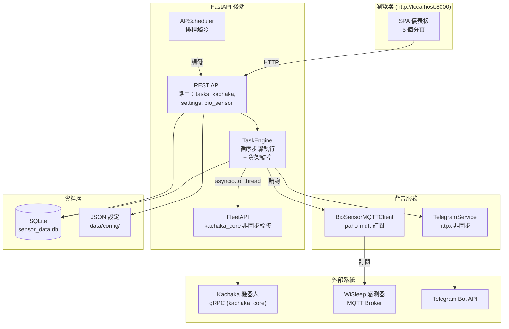
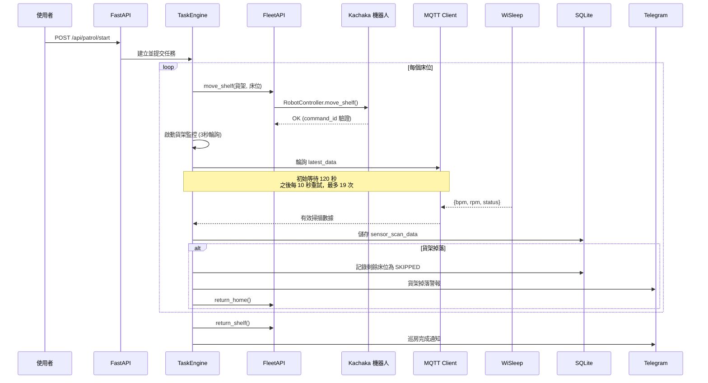
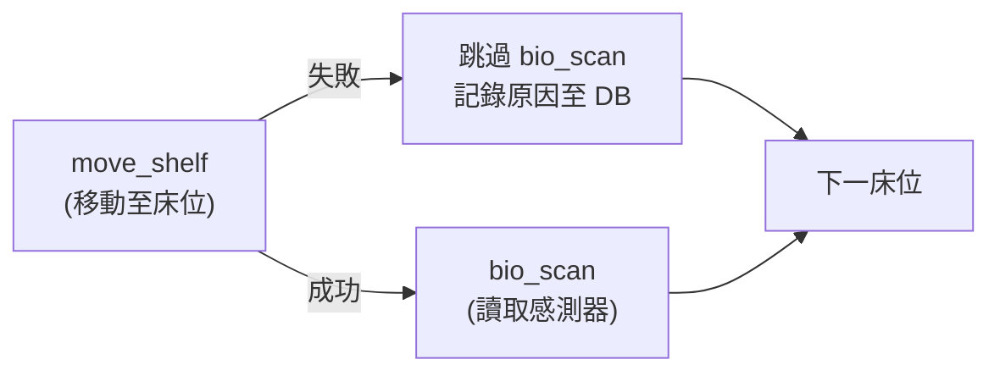
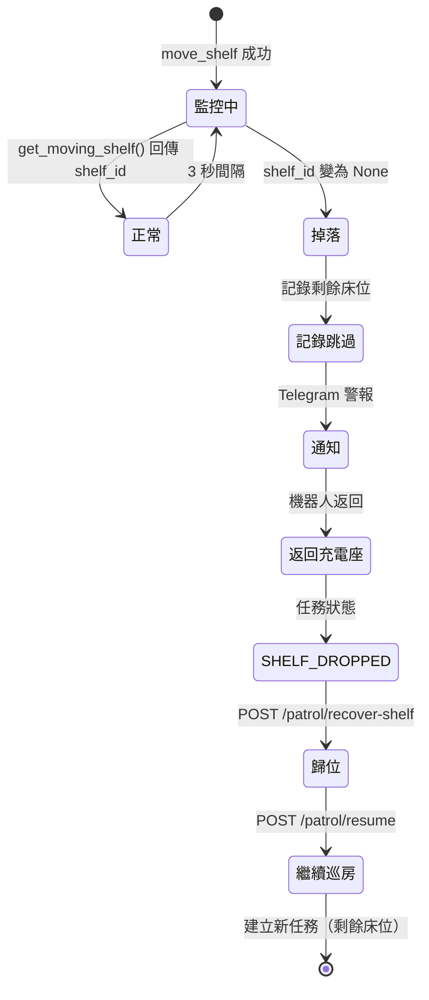
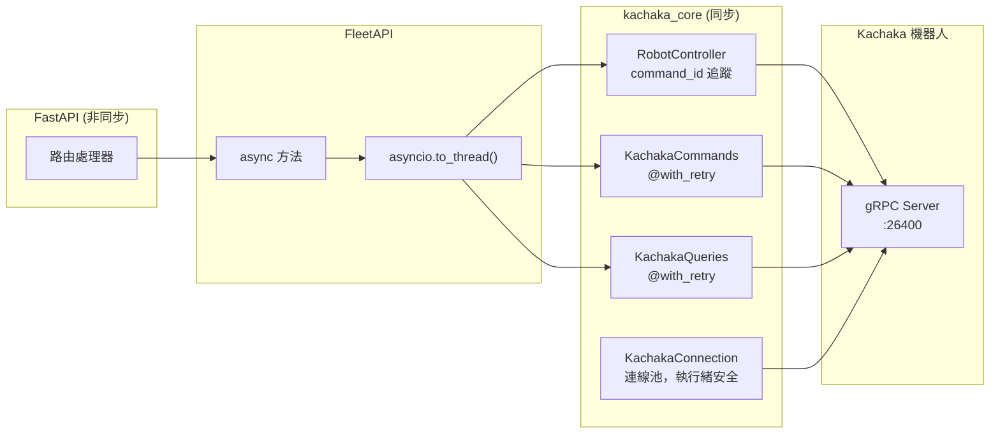
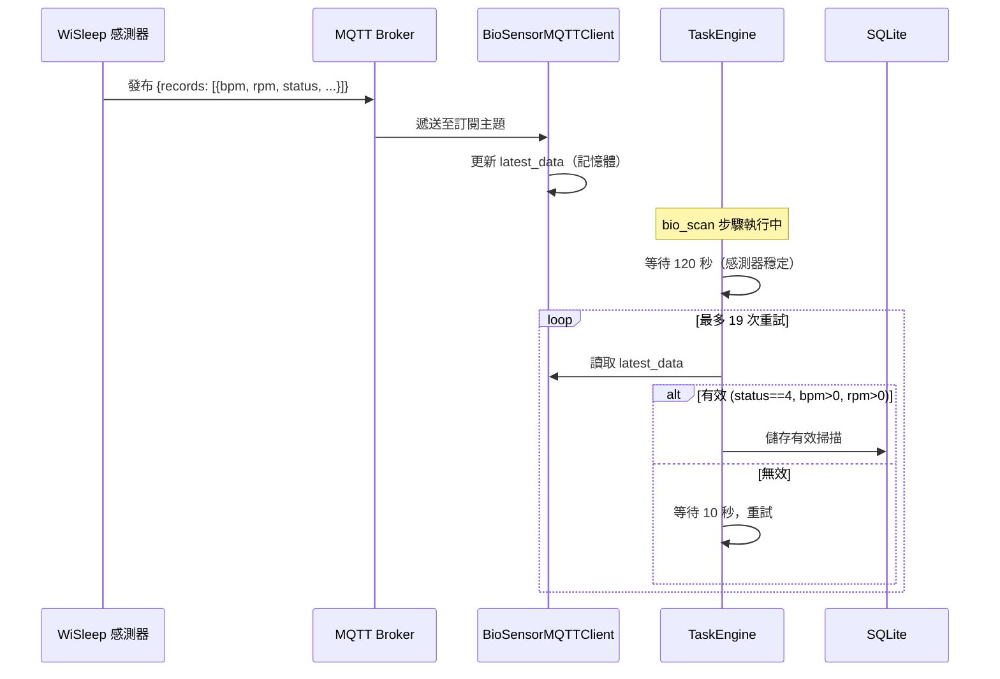
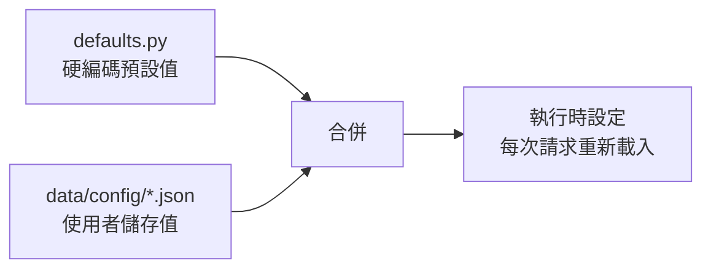

# Bio Patrol — 系統架構

## 概述

Bio Patrol 是基於 **Kachaka 移動機器人** 的自動化病房巡房系統。機器人攜帶搭載感測器的貨架依序移動至各床位，透過 MQTT 從 **WiSleep 生理感測器** 收集生命徵象（心率、呼吸率），數據存入 SQLite，異常時即時透過 Telegram 通報。

系統使用 **FastAPI** 搭配非同步任務執行引擎。機器人控制透過 [`kachaka-sdk-toolkit`](https://github.com/sigmarobotics/kachaka-sdk-toolkit)（`kachaka_core`）實現連線池管理、`@with_retry` 重試裝飾器，以及 `RobotController` 的 command_id 驗證執行。

## 系統架構圖

## 巡房執行流程

## 任務引擎

`TaskEngine` 是核心執行元件，將任務拆解為有序步驟序列，並支援條件式跳過邏輯。

### 步驟類型

| 步驟 | 動作 | 說明 |
|------|------|------|
| `move_shelf` | 搬運貨架至床位 | 成功後啟動貨架監控 |
| `bio_scan` | 透過 MQTT 讀取感測器 | 120 秒等待 + 19 次重試 @ 10 秒 |
| `return_shelf` | 歸還貨架 | 先停止貨架監控 |
| `wait` | 步驟間延遲 | 可配置時間 |
| `speak` | 機器人語音 | 床邊播報 |
| `return_home` | 返回充電座 | 巡房結束 |

### 條件式跳過邏輯

若 `move_shelf` 失敗，關聯的 `bio_scan` 步驟被跳過（原因記錄至 DB）。巡房繼續至下一床位。

### 貨架掉落偵測與恢復

## Kachaka 整合 (kachaka_core)

所有機器人操作透過 `FleetAPI` 非同步橋接至 `kachaka_core`：

### 每機器人 Slot

每台註冊的機器人包含一組 `_RobotSlot`：
- `KachakaConnection` — 池化 gRPC 連線
- `RobotController` — 背景狀態輪詢 + 命令執行
- `KachakaCommands` — 簡單操作含重試
- `KachakaQueries` — 狀態查詢含重試

## MQTT 生理感測器流程

## 資料庫

SQLite 檔案：`data/sensor_data.db`

### sensor_scan_data 資料表

| 欄位 | 類型 | 說明 |
|------|------|------|
| `id` | INTEGER PK | 自動遞增 |
| `task_id` | TEXT | 關聯任務 |
| `location_id` | TEXT | 機器人目標位置 |
| `bed_name` | TEXT | 床位名稱（如 101-1） |
| `timestamp` | TEXT | ISO 8601 格式 |
| `retry_count` | INTEGER | 讀取前重試次數 |
| `status` | INTEGER | 感測器狀態碼 |
| `bpm` | REAL | 心率（無效時 NULL） |
| `rpm` | REAL | 呼吸率（無效時 NULL） |
| `is_valid` | BOOLEAN | 有效讀取標記 |
| `data_json` | TEXT | 完整 MQTT 記錄 |
| `details` | TEXT | 人類可讀備註 |

## 設定系統

執行時設定以 JSON 格式儲存於 `data/config/`，載入時與預設值合併：

### 設定檔案

| 檔案 | 用途 |
|------|------|
| `settings.json` | 機器人 IP、MQTT、Telegram、掃描時間參數 |
| `beds.json` | 病房/床位配置與 location ID 對應 |
| `patrol.json` | 巡房路線（床位順序、啟用狀態） |
| `schedule.json` | 排程時間（每日/工作日） |

### 主要設定項

| 設定 | 預設值 | 說明 |
|------|--------|------|
| `robot_ip` | — | Kachaka 機器人 IP:port |
| `mqtt_broker` | `mqtt-broker` | MQTT broker 主機名稱 |
| `mqtt_port` | 1883 | MQTT 端口 |
| `bio_scan_initial_wait` | 120 | 初始等待秒數 |
| `bio_scan_wait_time` | 10 | 重試間隔秒數 |
| `bio_scan_retry_count` | 19 | 最大重試次數 |
| `bio_scan_valid_status` | 4 | 有效感測器狀態碼 |
| `shelf_id` | — | 搬運貨架 ID |
| `timezone` | `Asia/Taipei` | 顯示時區 |

## 前端

Vanilla JavaScript SPA，使用 Canvas 渲染地圖：

| 分頁 | 功能 |
|------|------|
| Dashboard | 即時地圖、感測器數據、排程、進度條、快速操作 |
| 床位選擇 | 點選啟用格子、自動儲存（500ms debounce）、預設路線 |
| 位置設定 | 病房/床位配置、location ID 對應 |
| 歷史紀錄 | 掃描歷史表格、統計卡片、CSV 匯出 |
| Settings | 機器人 IP、MQTT、Telegram、掃描參數、地圖管理 |

## 日誌系統

每模組獨立的旋轉日誌檔案，位於 `data/logs/`：

| 檔案 | 涵蓋模組 |
|------|---------|
| `app.log` | 主程式生命週期、fleet、telegram、settings |
| `task.log` | 巡房執行、機器人命令 |
| `sensor.log` | MQTT 感測器資料 |
| `scheduler.log` | APScheduler 事件 |

## CI/CD

GitHub Actions 建置多架構 Docker 映像：

- 平台：`linux/amd64`、`linux/arm64`
- Registry：`ghcr.io/sigmarobotics/bio-patrol`
- 觸發：推送至 `main`、版本標籤
